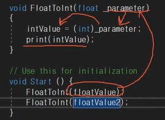

# 함수
입력이 들어오면 특정 논리적 연산을 한 뒤 출력하는 것

```csharp
int intValue;
float floatValue = 10.5f;

void FloatToInt(){
    intValue = (int)floatValue;
}
```
실수를 강제로 형변환하는 함수를 만들었다.

```csharp
int intValue;
float floatValue = 10.5f;
float floatValue2 = 20.5f

void FloatToInt(){
    intValue = (int)floatValue;
}
```
이 상황에서 `floatValue2`를 강제로 형변환 하고 싶다면, 또 다른 함수를 만들어야 하는가? 아니다. <br>
```csharp
int intValue;
float floatValue = 10.5f;
float floatValue2 = 20.5f

void FloatToInt(float parameter){
    intValue = (int)parameter;
}

void Start(){
    FloatToInt(floatValue);
    FloatToInt(floatValue2);
}
```
`FloatToInt(floatValue)`에서 `()`안에 원하는 변수를 입력하고, `()`안에 들어간 변수가 함수 안으로 들어가서 연산을 시작한다.


순서를 도식화 하면 다음과 같다 <br>

```csharp
void FloatToInt(float parameter, float parameter2, float parameter3){
    intValue = (int)parameter;
}

floatToInt(floatValue, floatValue2, floatValue3);
```
이런 식으로도 변수를 계속 받을 수 있다<br>
`float parameter = 3f`라는 식으로, 디폴트값을 설정해줄 수 있다.  <br>
단, 디폴트값으로 넣을 경우 가장 마지막에 변수로 설정해주어야 한다. <br>

# 반환값
`void`는 반환값이 필요가 없다. 다만, `int`와 같이 반환값이 존재할 경우 return을 넣어줘야 한다.
```csharp
int FloatToInt(float param, float param2){
    return 4;
}

intValue = FloatToIn(floatValue, floatValue2);
```
`FloatToInt`의 값은 4이다. 하여, 4라는 값을 저장할 변수 `intValue`가 존재한다. 

유의미한 값으로 변환하는 방법도 있다. 

```csharp
void FloatToInt(float parameter, float parameter2){
    return (int)(parameter + parameter2);
}

// 함수 자체를 출력
Debug.Log(floatToInt(floatValue, floatValue2, floatValue3));

// 결과는 31
```

 